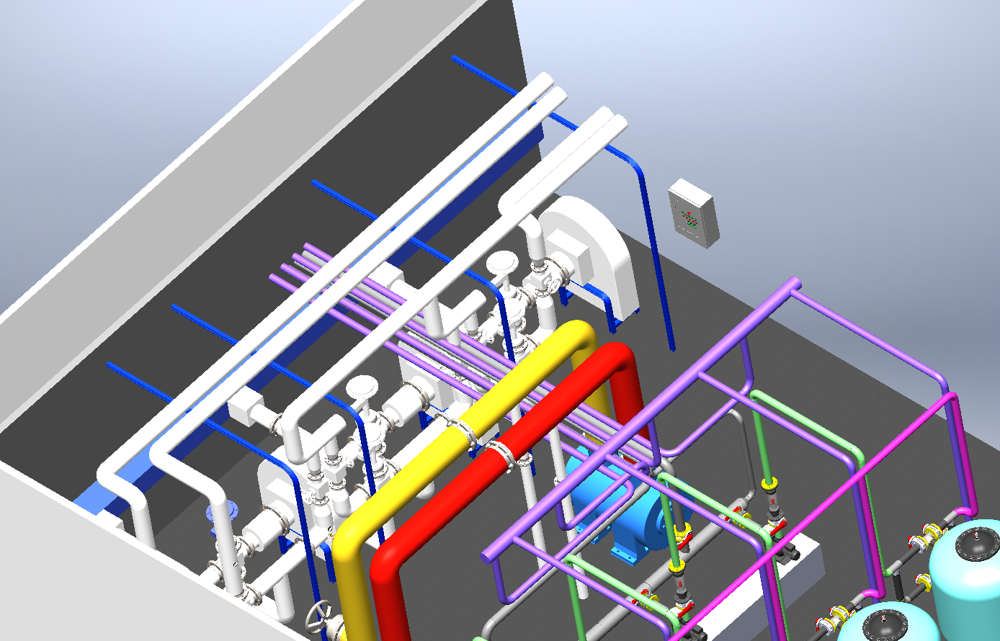

# Unity VR Interaction Demos

Small Unity (C#) VR interaction pack created for teaching/demo purposes.

## Modules
- **Surgical Light Control**: brightness + color temperature adjustment via UI sliders
- **Smart Door Interactions**:
  - proximity sensor auto-open
  - key insertion + handle rotation unlock workflow
  - collision rebound / self-closing behavior
- **Hospital Bed**: button-controlled backrest elevation (smooth motion + limits)
- **Ordering UI**: select item + quantity +/- + confirm → spawn & drop physical objects

## Tech
- Unity, C#
- XR: (XR Interaction Toolkit / OpenXR / SteamVR)

## Media
- Screenshots:

## Industrial Background (Thesis)
Built a 3D model of a chemical plant and evaluated observability across different VR setups (e.g., CAVE vs. standalone headset), deriving guidelines for visualization and platform trade-offs.

## Notes
This repository is meant as a compact portfolio showcase. Some assets may be omitted to keep the repo lightweight.

